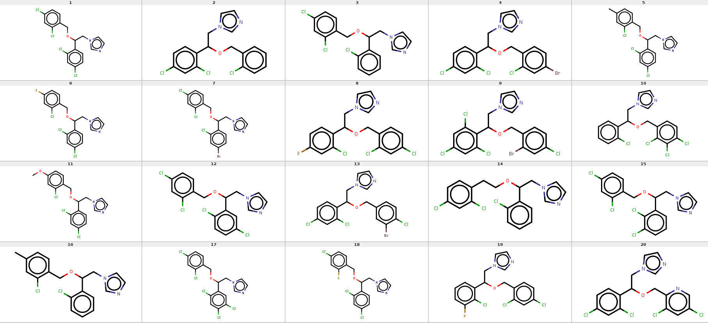

# LSTM_DrugAnalogGeneration


## <u>Dependencies</u>

Python3

Keras

Tensorflow

Numpy

rdkit

## <u>Analog Generation for Miconazole</u>

### Data 

1) CommercialFrags.smi.process: File containing around 40K fragments molecules collected from 		various supplier. The size of compounds are limited 17 heavy atom count. 

2) drugs: directory to hold a drug for which we would like to generate the analogs. In this case we have a file for Miconazole. This file contains the SMILES string of Miconazole repated for 20 times.


## Step 1: Build the global LSTM model for Commercial Fragments

Run the bash script ***s01_buildmodels.sh***

The content of the script is shown below.

```bash
#!/bin/bash

mkdir COMMERCIALFRAGMENTS_GLOBAL_MODEL

# Inputs
# 1) Input database (plain text file containing smiles)
# 2) Directory to hold the models
# 3) number of epochs
# 4) sequence length
 
python build_models.py CommercialFrags.smi.process COMMERCIALFRAGMENTS_GLOBAL_MODEL 50 32
```

## Step 2: Perform the Transfer Learning for Miconazole

 Run the bash script ***s02_fineTuneModelWRTQ.sh***

The content of the script is shown below

```bash
#!/bin/bash

# Directory to hold the generated fine tune models
mkdir COMMERCIALFRAGMENTS_FINETUNED_MODELS

# Do the fine tuning for each drug present in drugs folder. 
# In our case it's miconazole only
for drug in $(ls drugs)
do

	# Store the fine tuned models for each drug seperately
	mkdir COMMERCIALFRAGMENTS_FINETUNED_MODELS/$drug

	# Fine tune using different level of learning rates
	for lr in 0.01 0.005 0.001 0.0005 0.0001
	do

		# Store the fine tuned models using different learning rates seperately
		mkdir COMMERCIALFRAGMENTS_FINETUNED_MODELS/$drug/$lr

		# Inputs for build_models_finetune.py
		# 1) Input database used for primary training
		# 2) text file containing the SMILES of a drug
		# 3) Number of epochs
		# 4) Batch size
		# 5) Learning rate
		# 6) Output directory to hold the models

		python build_models_finetune.py CommercialFrags.smi.process
		COMMERCIALFRAGMENTS_GLOBAL_MODEL/keras_char_rnn.49.h5 drugs/$drug 20 4 $lr
		COMMERCIALFRAGMENTS_FINETUNED_MODELS/$drug/$lr

	done
done
```

## Step 3: Sample the analogs

Run the bash script ***s03_sampledCpds.sh***

The content of the script is shown below

```bash
#!/bin/bash

# Folder to hold the generated drug analogs
mkdir COMMERCIALFRAGMENTS_SAMPLED_DRUGSANALOGS

# Generate the analogs for each drug present in drugs folder. 
# In our case it's miconazole only
for drug in $(ls drugs)
do

	# store the data seperately for each drug
	mkdir COMMERCIALFRAGMENTS_SAMPLED_DRUGSANALOGS/$drug
	
	# input smiles string for sampling.
	drug_smi=$(head -n 1 drugs/$drug)

	# do the sampling with each model with different learning rates
	for lr in 0.01 0.005 0.001 0.0005 0.0001
	do

		mkdir COMMERCIALFRAGMENTS_SAMPLED_DRUGSANALOGS/$drug/$lr
		# sample after epochs 4 9 14 and 19
		for epoch in $(seq 4 5 19)
		do

			#sampled the compounds
			# Input for the script: sample_compounds.py
			# 1) Input database use for primary training
			# 2) Model for sampling
			# 3) Output file
			# 4) choice of method use for random sampling
			# 5) When using "numpychoice" this parameter does not matter. Just use
			# someplaceholder.
			# 6) Number of characters to sample
			# 7) Input string to start the sampling
			
			python sample_compounds.py CommercialFrags.smi.process
			COMMERCIALFRAGMENTS_FINETUNED_MODELS/$drug/$lr/keras_char_rnn.$epoch.h5
			COMMERCIALFRAGMENTS_SAMPLED_DRUGSANALOGS/$drug/$lr/${epoch}.smi "numpychoice"
			"0.5" 200000 $drug_smi

		done
	done
done
```

## Step 4: Filter the analogs for unwanted functional group and score them as per their similarity to Miconazole

Run the script s04_filterAndSortWRTQ.sh

The content of the script is shown below

```bash
#!/bin/bash

#make folder to hold data
mkdir COMMERCIALFRAGMENTS_SAMPLED_DRUGSANALOGS.FILTER

#process each drug
for drug in $(ls drugs)
do

	mkdir COMMERCIALFRAGMENTS_SAMPLED_DRUGSANALOGS.FILTER/$drug

	#process each learning rate
	for lr in 0.01 0.005 0.001 0.0005 0.0001
	do

		mkdir COMMERCIALFRAGMENTS_SAMPLED_DRUGSANALOGS.FILTER/$drug/$lr

		#process each epoch
		for epoch in 4 9 14 19
		do

			#filters compounds using rdkit smartqueries
			python removeCpdsBasedOnSmartsQ.py
			COMMERCIALFRAGMENTS_SAMPLED_DRUGSANALOGS.FILTER/$drug/$lr/$epoch.smi
			smartsq.txt out_tmp_filtered.smi "False"

			#calculate the similarity of generated compounds with respect to query
			python avalone_similaritycalculation.py $drug/$drugs out_tmp_filtered.smi
			COMMERCIALFRAGMENTS_SAMPLED_DRUGSANALOGS.FILTER/$drug/$lr/${epoch}.smi

			#remove intermediate files
			rm out_tmp.smi drug.smi out_tmp_filtered.smi

		done
	done
done
```

## Generated Miconazole analogs from learning rate 0.001 and epoch 4

